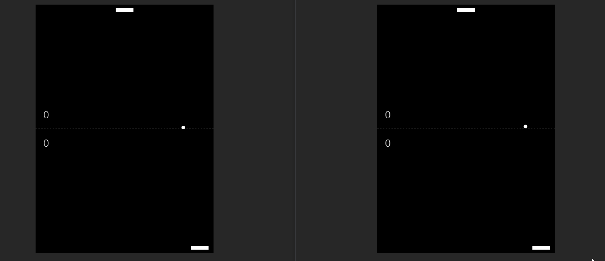

<div align="center"><h1>Socket.io Pingpong 🏓</h1></div>



# Table of Contents 📖
<!-- no toc -->
- [Introduction ✨](#introduction-)
- [How to run 🚀](#how-to-run-)
- [License 🔑](#license-)

## Introduction ✨
This a simple online multiplayer pingpong browser game that is build using [socketio](https://socket.io/) and [express](https://expressjs.com/). The front-end uses html, css and vanilla javascript as I was just learning and playing around with socket.io

<div style="text-align: justify">A client can connect to the server and won't be able to join a game until another client (player) is connected as well. Once there are any 2 players ready to play at any given time, the server will create a room and the 2 players will join that newly created room and start playing. The game doesn't end unless one of the player disconnects.</div><br>

## How to run 🚀
1. First clone the repo
```bash
gh repo clone maxlar01/socketio-pingpong
```
2. Navigate to the root directory and install project dependencies
```bash
npm i
```
3. Open index.html and have fun 😊


## License 🔑
You can read more about it [here](https://choosealicense.com/licenses/mit/)